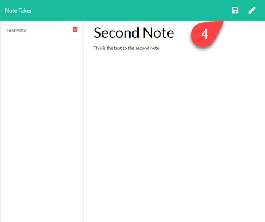

# Node.js-Note-Taker
Due Date: 4/10/2021 @ 11:59 PM
Coding Bootcamp assignemnt #11 - Express

# Objectives
The primary objectives of this exercise were to demonstrate the following:

* deeper understanding of express.js and routing
* fs and utf8 handling
* debugging and troubleshooting
* deployment to heroku
* github repo management

# Dependencies
This exercise requires the following npm modules
* express
* uuid

# Links
|Description|Link|
|-----------|----|
|github repo|https://github.com/jonesjsc/11-Node.js-Note-Taker|
|heroku deployment|https://github.com/jonesjsc/11-Node.js-Note-Taker|

## How to install
1. Clone this repo (`gh repo clone jonesjsc/11-Node.js-Note-Taker`)
1. `npm install`
2. `npm start`

## Screenshots

Get started with the "Get Started" button (1)

You are in edit mode and can enter a new Note Title and Note Text.  (2)
Notice that in the upper right corner before any edits are made, you 
have the ability to EDIT a new note (3)

Once you start typing an option to save the note is present through the "save disk" icon (4)

Once the note has been entered and saved, it will appear on the left hand navigation window (5)

The delete note function was properly routed and implemented on the back end (6)

## Fun Stats
* 
* 